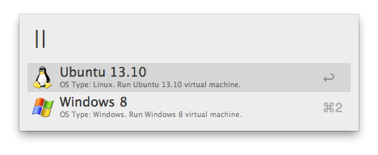
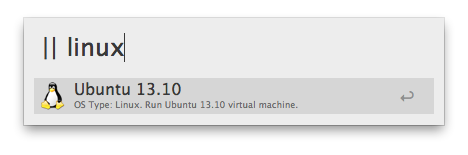

Parallels workflow
==

### Description
Alfred 2 workflow to simplify the booting of a [Parallels](http://parallels.com) virtual machine.

###### Note
This workflow assumes you have the Parallels software installed.

### Usage

`|| [optional argument]`

The `optional argument` is used to filter the list of available VMs by name or OS type. 
To customize VM's icon, you have to provide it in the *user_icons* directory, with the same name as the VM's in `~/Documents/Parallels`.
If no argument is provided, or it doesn't match any of the previous patterns, the latest comic will be shown. Note that the limit of the number of comics shown in a single run is set to 5 (hardcoded on line 5 of the script). Feel free to change that. 
To run a VM, simply select it from the list.

